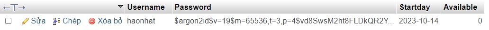

## Tech Stack

**Code:** Nodejs, nodemon, mysql, fetchAPI, dotenv, js.

## Installation | How to run server

> **<kbd>1.</kbd>** Install [node.js v16.14+](https://nodejs.org/en) or higher
>
> **<kbd>2.</kbd>** Open terminal **`cd server`**
>
> **<kbd>3.</kbd>** Install all of the packages with **`npm install`**
>
> **<kbd>4.</kbd>** Need to add the following environment variables to your `.env` file.
>
> **<kbd>5.</kbd>** Use [xampp](https://www.apachefriends.org/download.html) for database (`mysql`). You should create a database named `my-shop` (according to the `.env` file) and create an `account` table with fields as shown below..
> 
>
> **<kbd>6.</kbd>** Start server with **`npm start`**

#### **NOTE:**

> _If you are having errors/problems with starting delete the `package.json` file and do, before you install the packages `npm init`_

### API

You can use `.http` file (extension `REST Client`) instead of `Postman` to test the API

| Method | URL             | Description              |
| ------ | --------------- | ------------------------ |
| `POST` | `/api/register` | Create new account admin |
| `POST` | `/api/login`    | Login my-shop            |
